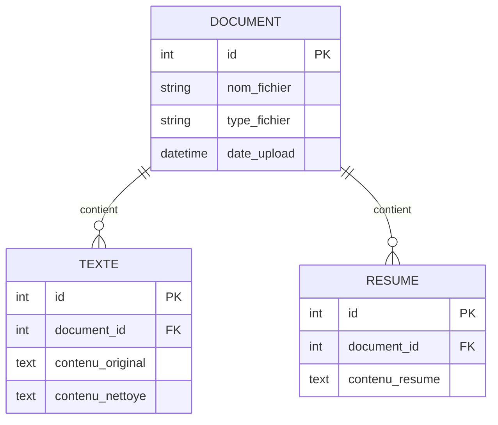

# rAIsume

Projet de démonstration d'intégration Omeka-S avec module de résumé automatique.

## Description

rAIsume est un projet académique qui démontre l'utilisation d'Omeka-S avec un module personnalisé. Le projet permet de créer des items dans Omeka-S avec génération automatique de résumés via l'API ApyHub.

## Prérequis

- Serveur web local (WampServer, XAMPP, MAMP, ou autre)
- PHP 7.4 ou supérieur
- MySQL
- Instance Omeka-S configurée

## Installation

### 1. Configuration d'Omeka-S

L'instance Omeka-S doit être accessible à l'URL suivante : `http://localhost/omk_thyp_25-26_clone`

Placer votre installation Omeka-S dans le répertoire web de votre serveur (ex: `www`, `htdocs`) et la renommer `omk_thyp_25-26_clone`

### 2. Base de données

Créer une base de données MySQL et la connecter à Omeka-S via le fichier `database.ini`.

### 3. Installation du module MySummarizer

Copier le dossier `MySummarizer` dans le répertoire modules d'Omeka-S :

```
C:\votre_serveur_web_local\omk_thyp_25-26_clone\modules\MySummarizer\
```

Activer le module via l'interface d'administration Omeka-S (Modules > MySummarizer > Installer).

### 4. Configuration de l'API Omeka-S

Dans le fichier `apiOmk.html`, remplacer les clés d'API :

```javascript
const key_identity = "votre_key_identity";
const key_credential = "votre_key_credential";
```

Ces clés sont générées dans l'interface Omeka-S (Utilisateur > Clés API).

## Structure du projet

### Projet principal

```
rAIsume/
├── apiOmk.html     # Interface web pour interagir avec l'API Omeka-S
└── README.md       # Documentation
```

### Module MySummarizer

```
MySummarizer/
├── config/
│   ├── module.config.php         # Configuration des routes et services
│   └── module.ini                # Métadonnées du module
├── src/
│   ├── Controller/
│   │   └── FormController.php    # Contrôleur du formulaire
│   └── Service/
│       └── SummaryService.php    # Service de génération de résumés
├── view/
│   └── my-summarizer/
│       └── form/
│           ├── index.phtml       # Vue du formulaire
│           └── result.phtml      # Vue des résultats
├── composer.json
└── Module.php                    # Classe principale du module
```

## Modèle de données (Diagramme Entité-Relation)



## Utilisation

### Interface web (apiOmk.html)

1. Ouvrir `apiOmk.html` dans un navigateur
2. Trois fonctionnalités disponibles :
   - **Afficher les items** : Récupère et affiche tous les items existants
   - **Créer un item** : Ajoute un nouvel item avec résumé automatique (50 premiers mots)
   - **Module MySummarizer** : Accès direct au module via iframe

### Module MySummarizer

Accessible à l'URL : `http://localhost/omk_thyp_25-26_clone/summarizer`

Le module permet de :
1. Saisir un titre et un texte
2. Générer automatiquement un résumé via l'API ApyHub
3. Créer l'item dans Omeka-S avec les métadonnées Dublin Core :
   - `dcterms:title` : Titre de l'item
   - `dcterms:description` : Texte complet
   - `dcterms:abstract` : Résumé généré

## Fonctionnalités techniques

### API Omeka-S

Le projet utilise l'API REST d'Omeka-S pour :
- Lire les items (GET)
- Créer des items (POST)

### Génération de résumés

Deux méthodes de résumé :
- **apiOmk.html** : Extraction simple des 50 premiers mots
- **MySummarizer** : Résumé intelligent via l'API ApyHub (IA)

### Service ApyHub

Le module utilise l'API ApyHub pour générer des résumés en français. 

Un token d'API personnel est déjà configuré dans le fichier `SummaryService.php` :

```php
$apyToken = 'APY04yQjQCle4BiHGatNS8uMW3Oo2JEzWKxyTFWVpMdw3GmqEJa9qqO2LojQ0Oa4QYcTZH1BwGUi0A';
```

Le projet fonctionnera directement avec ce token pour faciliter les tests. Si vous souhaitez utiliser votre propre token ApyHub, vous pouvez en créer un gratuitement après avoir créé un compte sur [apyhub.com](https://apyhub.com).

## Configuration SSL

Pour un environnement de développement local, la vérification SSL est désactivée dans les requêtes cURL :

```php
curl_setopt($ch, CURLOPT_SSL_VERIFYHOST, false);
curl_setopt($ch, CURLOPT_SSL_VERIFYPEER, false);
```

## Auteur

Thomas DA SILVA - Projet de cours Master THYP 2025-2026
